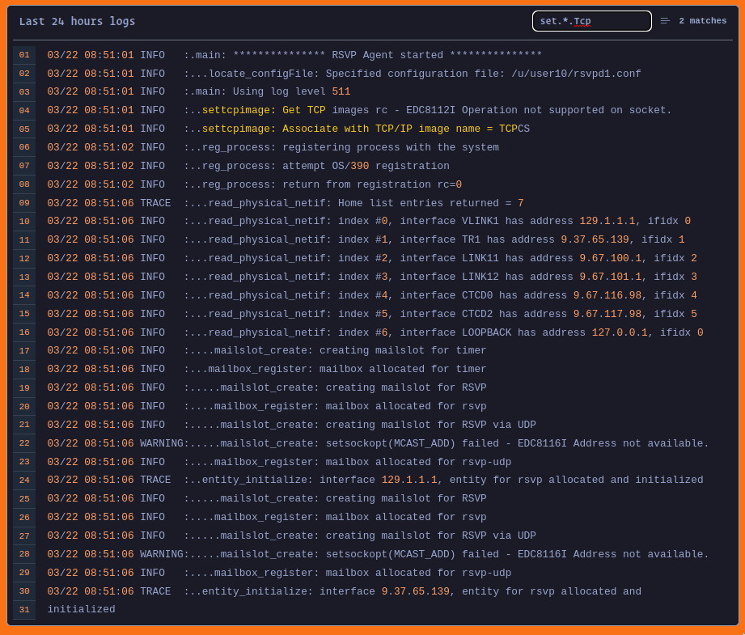

# React HighlightJs Logs



## Demo

[https://react-highlightjs-logs.netlify.app/](https://react-highlightjs-logs.netlify.app/)

## Usage

### Installation
Run the following command in your terminal to install the package.

```bash
npm i react-highlightjs-logs
```

### Importing
You can import the component as shown below.
```javascript
import { HighlightJsLogs } from "react-highlightjs-logs"
```

### Importing Styles
You can import the component as shown below.
```javascript
import 'react-highlightjs-logs/dist/styles/index.css'
```

### Importing Themes
This package contains only one theme that's tokyo-night which can be imported as shown below. 
```javascript
import 'react-highlightjs-logs/dist/themes/tokyo-night.css'
```

You can also use any of the [highlight.js](https://github.com/highlightjs/highlight.js/tree/main/src/styles) themes. you can get themes from [highlight.js themes](https://github.com/highlightjs/highlight.js/tree/main/src/styles) or you visit the [highlight.js demo](https://highlightjs.org/static/demo) for more.


#### With plain data
If you have plain data then you can use the component as shown below.
```javascript
function App() {
  return (
    <div className="p-6">
      <HighlightJsLogs 
        title="Last 24 hours logs" 
        text={`your logs`}
      />
    </div>
  );
}
```

#### With url
With url you can use the component as shown below.
```javascript
function App() {
  return (
    <div className="p-6">
      <HighlightJsLogs 
        title="Last 24 hours logs" 
        url="https://example.com"
      />
    </div>
  );
}
```

### With websocket
If you wanna use with websocket then use as the shown below.
```javascript
function App() {
  return (
    <div className="p-6">
      <HighlightJsLogs 
        title="Last 24 hours logs" 
        url="wss://example.com" 
        websocket={true}
      />
    </div>
  );
}
```

### enablesearch, follow, selectableLines
You can also enable searching, autoscroll to last line, and highlight line on hover by the following properties. 
```javascript
function App() {
  return (
    <div className="p-6">
      <HighlightJsLogs 
        title="Last 24 hours logs" 
        data="Hello World!" 
        enablesearch={true} 
        follow={true} 
        selectableLines={true}
        />
    </div>
  );
}
```
By default all the values are true you can disable this by changing it's value to false.

### Hide scrollbar
You can hide the scrollbar by simpaly adding noScrollBar attribute as shown below. The default value is false so scrollbar will be visible if you don't add.
```javascript
function App() {
  return (
    <div className="p-6">
      <HighlightJsLogs 
        title="Last 24 hours logs" 
        data="Hello World!" 
        noScrollBar
        />
    </div>
  );
}
```

### Maximum Height
Provide the maximum height for the better adjustment on your ui. The default value of maximum height is 300px.
```javascript
function App() {
  return (
    <div className="p-6">
      <HighlightJsLogs 
        title="Last 24 hours logs" 
        data="Hello World!" 
        maxHeight="calc(100vh - 9rem)"
        />
    </div>
  );
}
```

### Maximum Height
if you want to render only last n number of lines then provide maxLines as shown below.
```javascript
function App() {
  return (
    <div className="p-6">
      <HighlightJsLogs 
          maxHeight="calc(100vh - 9rem)"
          noScrollBar
          title="Last 24 hours logs" 
          url={`/logs.txt`} 
          maxLines={100}
        />
    </div>
  );
}
```

### Font Size
You can also manage Font Size by adding fontSize property. It's Number value and can be provided as shown below. default fontSize is 14.

```javascript
function App() {
  return (
    <div className="p-6">
      <HighlightJsLogs 
          maxHeight="calc(100vh - 9rem)"
          title="Last 24 hours logs" 
          url={`/logs.txt`} 
          fontSize={14}
        />
    </div>
  );
}
```

### Define your own loading component
You can also define your own loading component as shown below.

```javascript
function App() {
  return (
    <div className="p-6">
      <HighlightJsLogs 
          maxHeight="calc(100vh - 9rem)"
          title="Last 24 hours logs" 
          url={`/logs.txt`} 
          fontSize={14}
          loadingComponent={<span>Loading...</span>}
        />
    </div>
  );
}
```

### Define your own loading component
Define your action components easily by providing component to the property actionComponent as shown below.

```javascript
function App() {
  return (
    <div className="p-6">
      <HighlightJsLogs 
          maxHeight="calc(100vh - 9rem)"
          title="Last 24 hours logs" 
          url={`/logs.txt`} 
          actionComponent={
            <button>
              Refresh
            </button>
          }
        />
    </div>
  );
}
```

## Technology
- highlight.js for syntax highlighting
- websocket for socket connection
- axios for fetching url data
- react-icons for icons
- tailwindcss for design
- tokyo-night default theme

## Development and Contributing
This repository uses highlight.js, websocket, axios, react-icons and tailwindcss for developing, previewing and building react components. to get started

- Fork and clone this repo
- Install the dependencies with npm or pnpm
- Start development server with npm start. This will launch a preview screen. Open a browser to http://localhost:3000 to preview the React Component.
- Use CTRL-C to exit the preview.
- Use npm run build to generate the compiled component for publishing to npm.

Feel free to open an issue, submit a pull request, or contribute however you would like. Understand that this documentation is still a work in progress, so file and issue or submit a PR to ask questions or make imporvements. Thanks!
